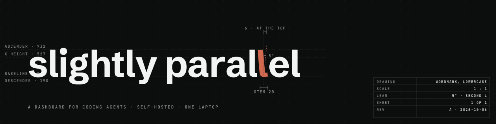

# Slightly Parallel

[](https://github.com/NMar33/slightly-parallel/actions/workflows/ci.yml) [](https://github.com/NMar33/slightly-parallel/releases) [](https://www.python.org) [](LICENSE) [](https://youtu.be/NmtQgkg-D-E)

**A local dashboard for running many projects with many coding agents at once, without losing the thread of what is happening.**

It keeps every chat, puts the work on a board, and makes the agents write down what matters: what changed, what was decided, what the project is for. The aim is a step from vibe coding to leading a team of agents: you know the code, the architecture and the decisions, even when an agent wrote most of it.


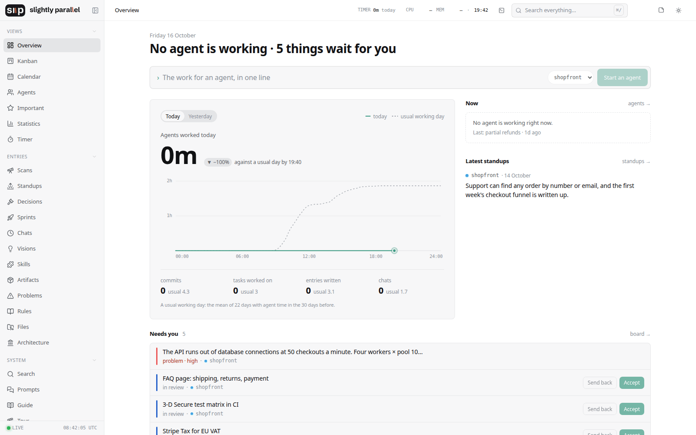

The project on film, in a minute or in six: [Slightly Parallel in a minute](https://youtu.be/NmtQgkg-D-E) (0:58) · [Every page](https://youtu.be/eZ0_f1sKaLE) (6:42)

**Contents**
- [Install](#install)
- [How it is meant to be used](#how-it-is-meant-to-be-used)
- [Three principles](#three-principles)
- [Limits](#limits)
- [In detail](#in-detail): [Chats](#chats) · [The board](#the-board) · [Standups](#standups) · [The commands](#the-commands) · [Skills](#skills) · [Artifacts](#artifacts) · [Entry points](#entry-points)
- [FAQ / Problems](#faq--problems)
- [What it needs and where the data is](#what-it-needs-and-where-the-data-is)
- [More](#more)

## Install

The same steps on film: [Install it and connect your first project](https://youtu.be/iVSJEZdb7Nw) (4:08).

You need Python 3.11+ and git.

```bash
git clone https://github.com/NMar33/slightly-parallel.git
cd slightly-parallel
./run.sh --prod       # Linux, macOS
```

On Windows, instead of `./run.sh --prod`: `sp run --prod`.

The app is at http://127.0.0.1:8123. It makes the data folder `~/.slightly-parallel` and fills it with an example project: a month of work on a small online store, with its chats, tasks, commits and standups, so every page has something on it and you can try everything before connecting your own code. Hide it from the sidebar when you no longer need it.

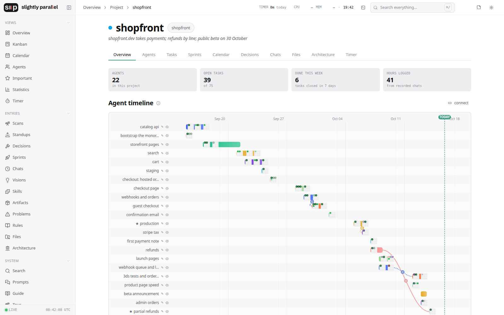

Then connect a project. On the **Setup** page:

1. **Data folder** — where Slightly Parallel keeps its records. The default is fine.
2. **Integrate a project** — a short code and the folder where its code is. Setup shows the files it is about to write and writes them: a section in the project's `AGENTS.md` (and a line in `CLAUDE.md`), the capture hooks, the MCP server entry.
3. **Start an agent in that folder** — Claude Code, Codex, OpenCode or Cursor, as you always do. The first answer begins with `[slightly-parallel] project … · your agent_id is …`. From then on the chat is recorded.

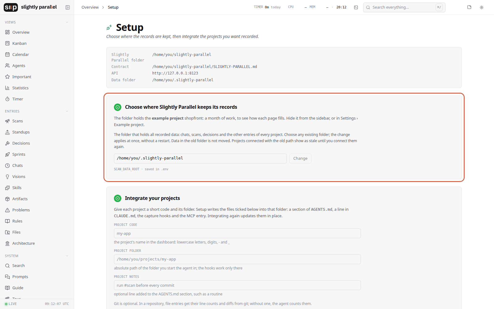

**Tick the box of every tool you use.** A project records the chats of a tool only if that tool's box was ticked when the project was integrated: Claude Code hooks, Codex hooks, OpenCode plugin, Cursor hooks. Every tool's box is ticked by default: a file a tool never reads costs nothing, a chat that was not recorded is gone. Untick a tool only if you are sure you do not use it. Each integrated project shows which tools it records; a tool you have that a project does not record gets a line and a **Connect** button.

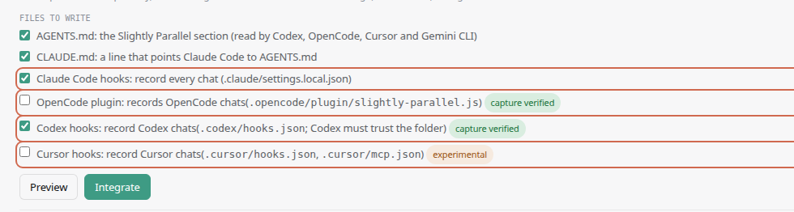

Good to know:

- **The chats are recorded even when the server is not running.** The hooks write them; the server reads them when it is up.
- **To start the server again:** `./run.sh --prod` (Windows: `sp run --prod`). To keep it running in the background: [docs/running.md](docs/running.md).
- **Where everything is:** the data folder, one folder per project under `projects/<code>/`, the chats in it as `chat.md`, the tasks and the rest as CSV plus one Markdown file per entry. Plain files; copy the folder and you have a backup.
- **The commands** you type in a chat: `#task`, `#now`, `#scan`, `#decision`, `#vision`, `#rule`, `#problem`, `#skill`, `#prompt`, `#important`, `#entrypoint`, `#artifact`, `#help`. Each is explained [below](#the-commands).

Working on Slightly Parallel's own code needs Node 20+: [docs/development.md](docs/development.md).

## How it is meant to be used

Slightly Parallel is built around a cycle, not a prompt.

You give an agent a long task: something that takes time, or something you want in several variants. While it works, you look at the product. That is when the ideas come, and the fixes: **they go to the kanban board**, into lanes, by theme. When the agent is done, you look at what it made, and give it the next batch from the board. **Every task on the board is tied to the chat** it came from or was done in, so the context of any card is one click away.

When a stage of work is over and the agent still holds everything in its context, **you type `#scan`.** The agent writes a checkpoint: what changed since the last one, the files that matter and why, what moved in the architecture. The next morning the first agent that touches the project writes yesterday's **standup** from every chat of the day: what moved, what went wrong, what waits for your answer.

**A month later you open the project and read the standups and the scans, and the month comes back.** 

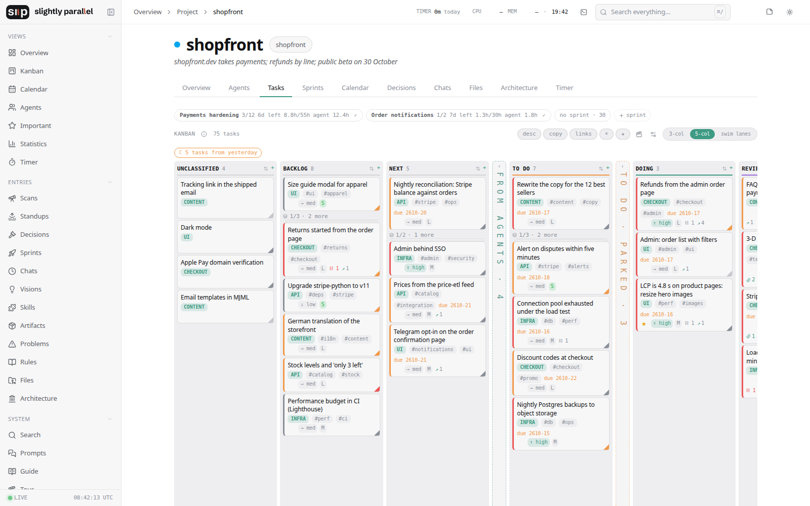

## Three principles

**As little discipline as possible.** Using it must not take attention. The first benefits come right after integrating a project, before you type a single command: the chats are recorded and the statistics counted.

**Against slop.** Better to lose something than to drown everything in noise. That is why almost nothing is written by itself: the chats, the standups and the decisions are; everything else waits for a command.

**Kept, versioned, connected.** What was written stays and keeps its versions. A task knows its chat, a scan knows its files, a decision knows the day it was made. There are many ways into the same thing, and from each you can see what it is connected to.

## Limits

I work on Linux and mostly with Claude Code, so that is where everything is tested most. macOS and Windows, and Codex, OpenCode and Cursor, were built for and tested where I could (the test suite runs on all three systems), but there will be bugs I have not seen. I expect your agent will make it work in your environment without much trouble: the code is plain Python and TypeScript, and the contract the agents follow is in the repository.

One person, one computer. The server has no login and listens on `127.0.0.1` only.

## In detail

### Chats

Whatever tool you work in, every chat of a project goes into one stream. The Chats page shows it by sessions, with the agent, the time, the files it touched and what came out of it; the whole stream without the session breaks; or one chat full screen, the focus mode, with its own text size. Search covers every message of every project. The agents and the chips beside them filter the list; the month at the top takes you to a day.

The recording is done by hooks (Claude Code, Codex, Cursor) and a plugin (OpenCode). The server does not need to be running.

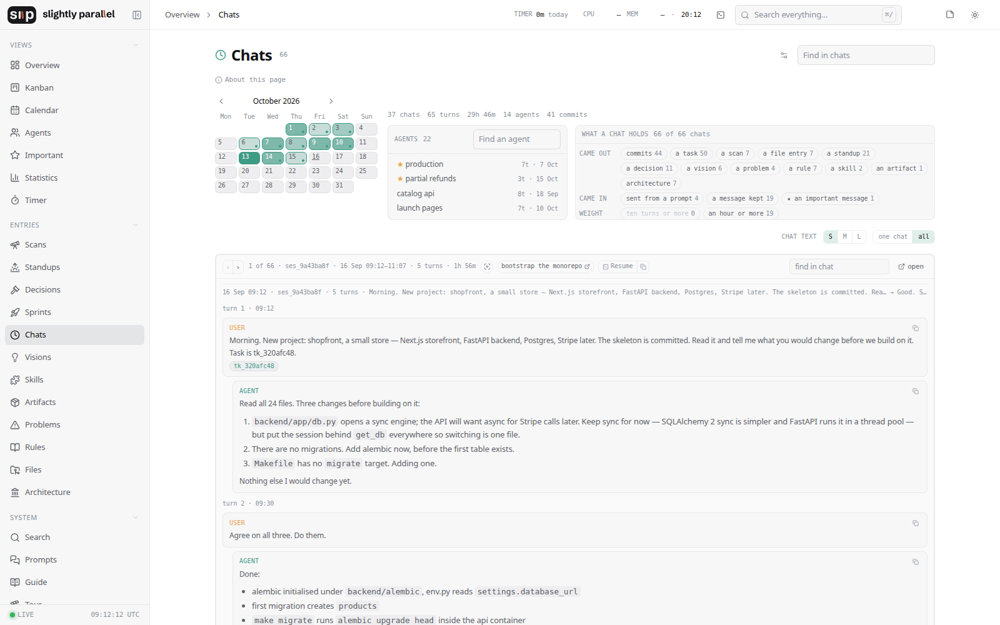

### The board

A Kanban board per project, with columns for the whole cycle: Backlog, Next, From agents, To do, Doing, Review, Done. Agents add cards only to From agents; you move them. There is a lanes view, where cards group by theme, and a three-column view for the day.

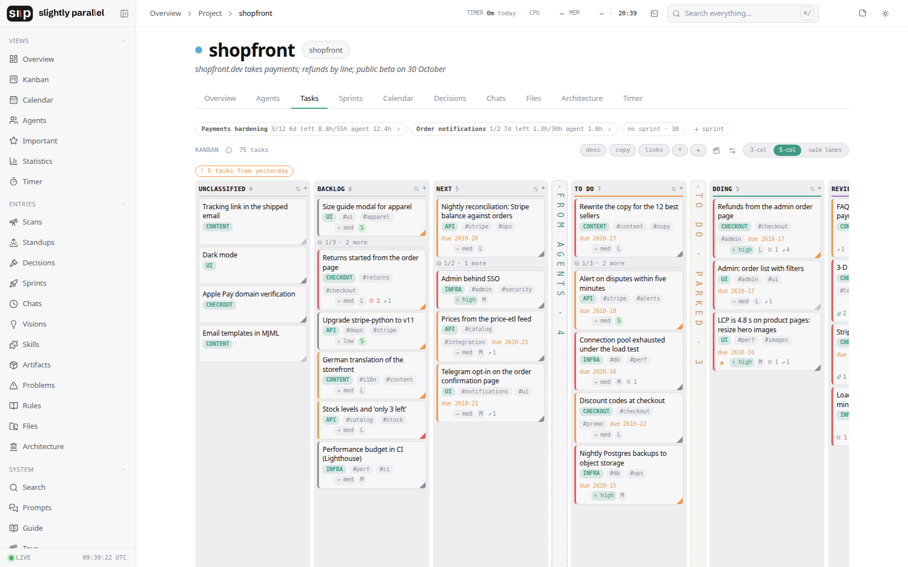

A card is a task window: description, tags, milestone, the chat it came from, the evidence of what was done. For sorting a backlog there are axes on every card: priority, impact, effort, novelty, tokens; the views order by them. 
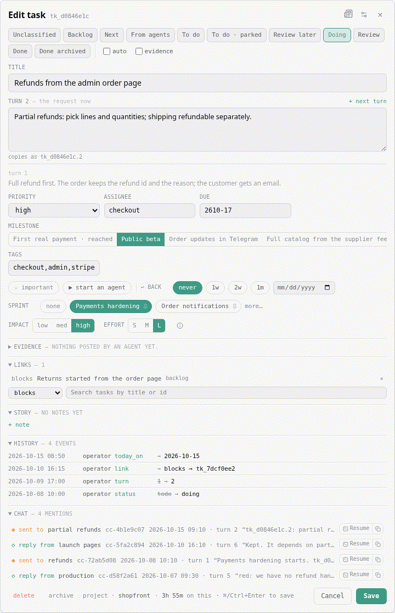

Two clicks for the day's work. Ctrl-click a card (⌘ on macOS) and it is planned for today: it gets a star, moves to the top of its column, and the Today strip above the board counts it.

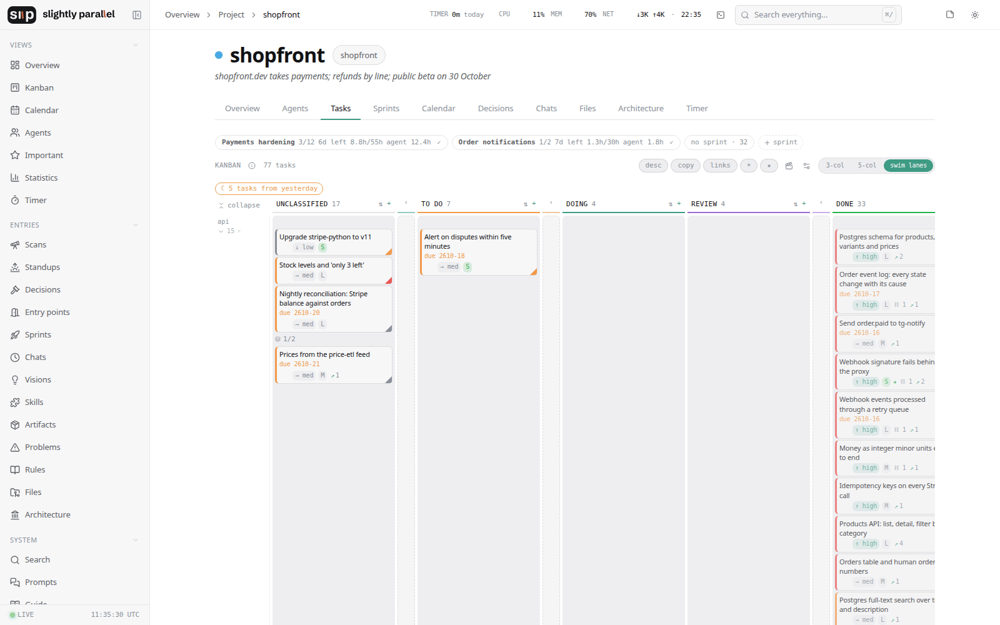

Shift-click cards to select them in order; the bar at the bottom groups them into a queue behind the first, plans them all for today, or copies them to paste to an agent as one batch. Drag any selected card and they all move.

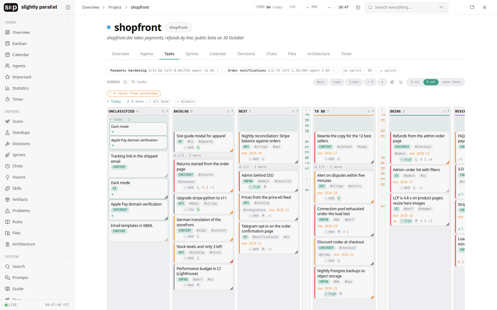

### Standups

One standup per project per day, written by the first agent that works on the project the next day, from every chat of the day: the summary, what went wrong, what moved (new, changed, fixed, decided). 
This is the project's diary, written without you.

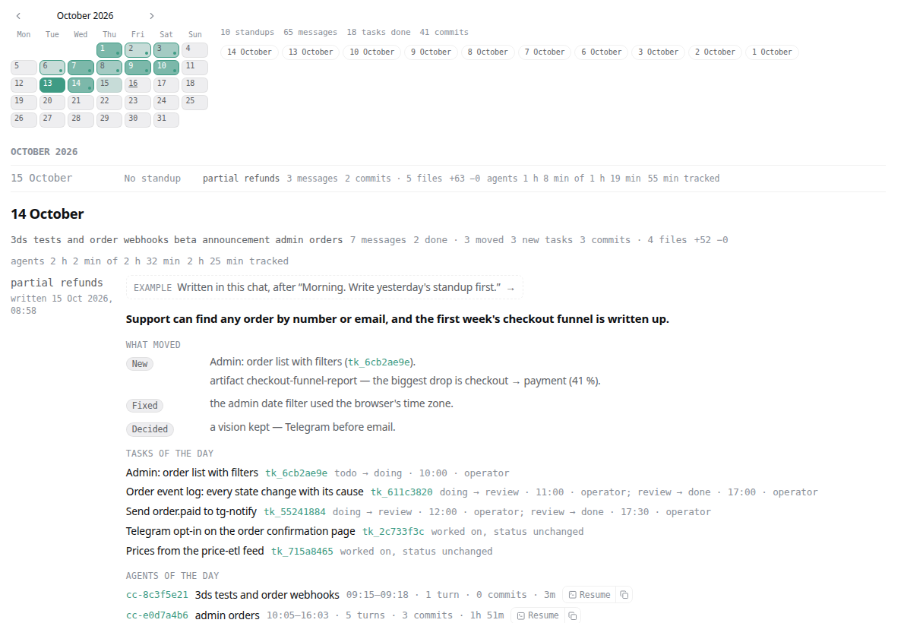

### The commands

A command is one word anywhere in a message to an agent. The agent does the writing; you read the pages.

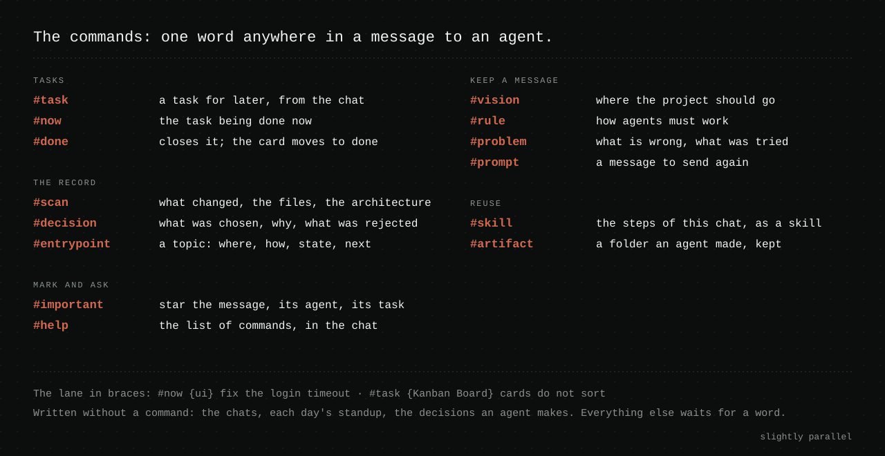

**`#scan`** — a checkpoint. Type it when a stage is shipped, while the agent still holds the context. The agent writes what changed since the last scan, the important files with why they matter + the architecture form.

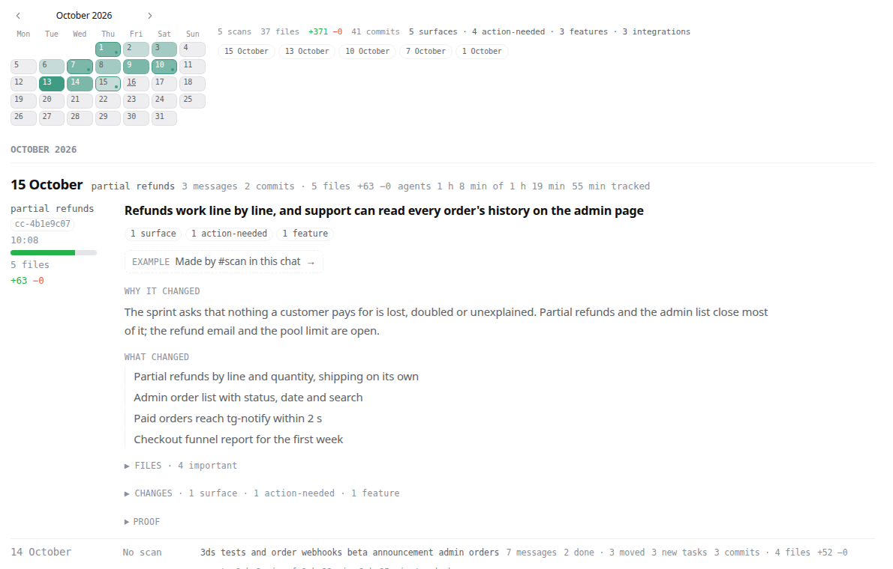

**`#decision`** — what was chosen, why, and what was rejected. Agents log decisions when a piece of work is done; `#decision` logs one now.

**`#vision`** — an idea of where the project should go, kept as you wrote it; the agent writes what it means. Visions written in a terminal are lost by the next week, and the agents that rebuild the app a year later never knew them. Here they stay, with versions. Visions of one kind (design, backend) go into a set; a set is dragged onto a project and written into its `AGENTS.md`. The relevant vision travels between projects.

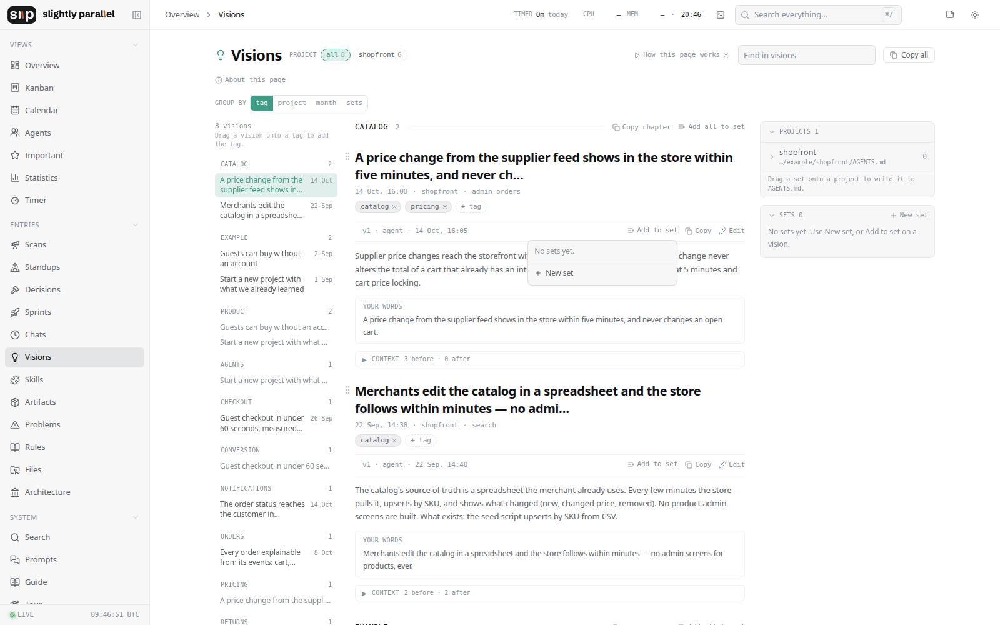

**`#rule`** — a correction to how agents work. A rule for all agents goes into every project's `AGENTS.md`; a set of rules into one project. **`#problem`** — a problem, with what was tried; `#problem solved` closes it, and a rule can be made from it. Both are kept the same way as visions: sets, versions, projects.

**`#important`** — marks the message, its agent and the task it names; `#important-message`, `-agent`, `-task` mark one of them. The Important page collects them.

**`#prompt`** — keeps the message as a prompt to send again, with versions A and B, a rating, and the chats it was sent in.

**`#task`** and **`#now`** — two commands for tasks. Both are typed in the chat, anywhere in the message; the difference is when the work is done.

`#task` is a task for later. You noticed a bug, deferred a step, had an idea: `#task the form accepts an empty trigger_id`. The agent writes the card from the context of the conversation, the way you would have written it with the time, and puts it in the From agents column. That column is the review: you drag the card on when you have looked at it.

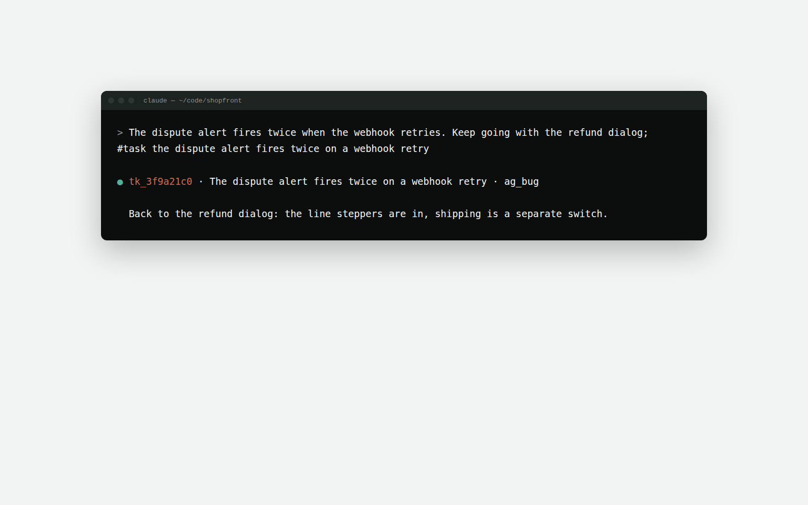

`#now` is the task being done now. `#now fix the login timeout`. The agent writes the card into Doing, in the Now lane, marks it with today, and only then starts the work. Everything that follows in the chat, the decisions, the evidence, the commits, is tied to that card. `#done` closes it: the server moves the card to done and counts its stretch of the chat. Too lazy to open the board: you do not have to.

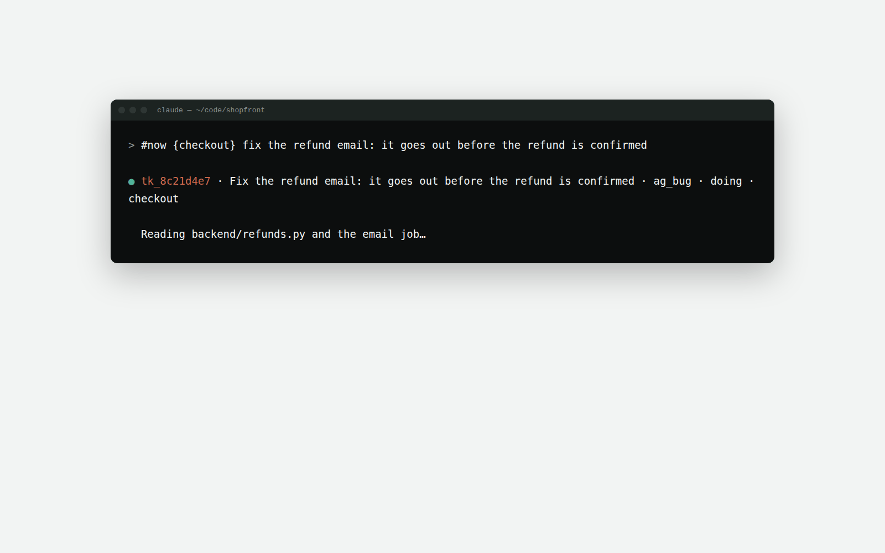

The lane goes in braces right after the tag: `#now {ui} fix the login timeout`, `#task {Kanban Board} cards do not sort`. The server reads the lane from the message, not the agent, so there is nothing to guess. A lane that is not on the board is refused with the list of those that are; the agent asks in one line. New lanes are made on the board. Without braces `#task` lands in `unassigned`, `#now` in Now (the name is a setting).

**`#entrypoint`** — the way into a topic. Say the topic, and the agent writes what it is, where its files and links are, how to run it, where the work stopped and what is next. Repeat it on the same topic and the state is replaced. Coming back to a project after three weeks starts here.

**`#help`** — the list of commands, in the chat.

### Skills

A skill is a folder with a `SKILL.md` that an agent loads when a task fits. Type `#skill` after a piece of work and the agent writes the steps from that chat, so the next agent does it the same way. A skill is installed into one project or into all; skill folders already on your computer are taken in; each use is counted. Everything the commands above do, the agents do through skills that come with Slightly Parallel, and you can rewrite any of them.

### Artifacts

An artifact is a folder an agent made for you that is worth keeping beyond one chat: a dataset, a document, a page, a small app. You say what you want with `#artifact`; the agent writes the folder under the project, the server records it, and the Artifacts page shows the folder and previews its files.

An example. Claude Code started writing the help texts and descriptions in my own program in a strange voice: metaphors, filler, sentences that said nothing. I gave an agent a few samples and asked it to find every text like that and rewrite each in three to five ways, with the context of where the text sits. The result was a file: the original, the variants, and my choice for each. That file is worth more than the fixes: it is now an artifact, and when the same voice comes back in another project, the agent reads it and knows what to do.

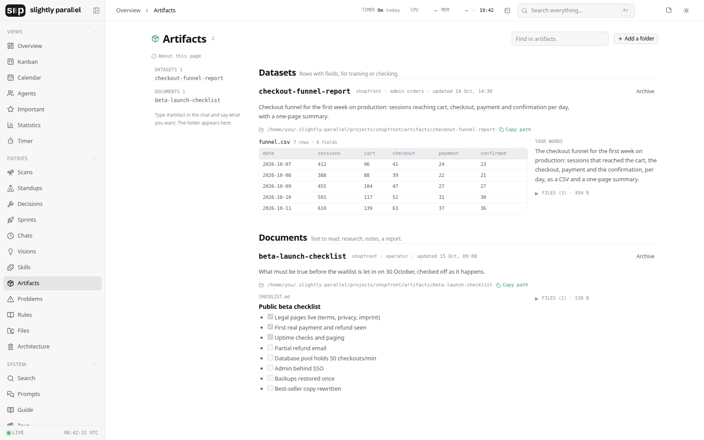

### Entry points

Notes per topic, written by the agent on `#entrypoint`: what the topic is, where its files are, how to run it, where the work stopped, what is next. The open topics stay at the top of the page with their State line. This is what you read first when you come back.

### Your hours

The Timer page keeps your own time, per project and per block of work (a sprint, a theme, a client). A block's timer is started by hand, or runs on its own while an agent is working in the project and pauses when you step away. One page shows today as a dial, the last 26 weeks as a grid, and every entry with its note.

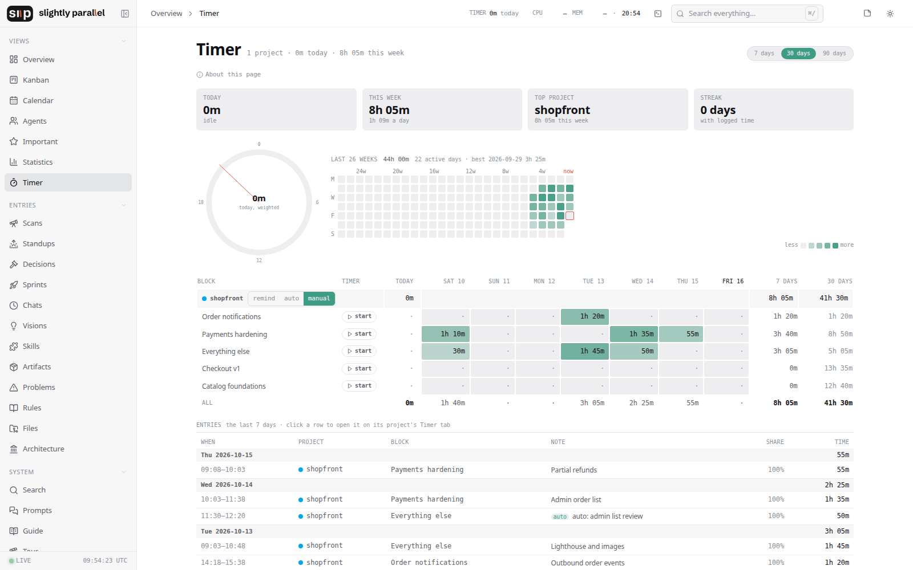

### Monitor

The Monitor page shows this computer's load: CPU, memory, disk, the connection, the heaviest programs, and what was unusual in the last seven days. Under it, the server's own state: whether every chat is being recorded, the backups, the slowest requests, and the log. When something is wrong with Slightly Parallel itself, this is where it says so.

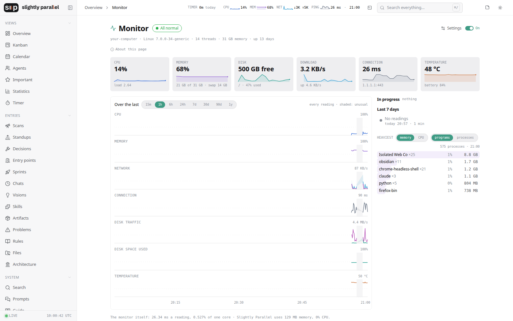

## FAQ / Problems

- **I integrated the project, but the chat is not recorded.**
	- Check that the tool you work in records this project: on the Setup page each integrated project lists the tools it records (see [Install](#install)). A Codex, OpenCode or Cursor chat is not recorded without its own box. Press **Connect** beside the tool on the project's row, then start a new chat: a tool reads its hooks when a chat starts.

<details>
<summary><b>Possible problems</b></summary>

- On Ubuntu, Codex with its default sandbox cannot read the files.

</details>

## What it needs and where the data is

- One person, one computer. The server listens on `127.0.0.1` and has no login; the network is off unless you turn it on ([docs/configuration.md](docs/configuration.md)).
- The data is plain files in the folder you chose: one CSV per kind of entry, one Markdown file per entry, the chats as `chat.md`. No database server. Back it up by copying the folder, or let the Backups page do it.
- Agents write only through the MCP server (`write_entry`); the server refuses an agent's write that comes any other way. The contract they follow is [`SLIGHTLY-PARALLEL.md`](SLIGHTLY-PARALLEL.md).
- The pages: Overview, Project, Chats, Scans, Standups, Decisions, Kanban, Sprints, Calendar, Timer, Visions, Rules, Problems, Skills, Prompts, Artifacts, Entry points, Important, Architecture, Files, Search, Agents, Timelapse, Monitor, Backups, Settings. English and Russian.

## More

- [docs/integration.md](docs/integration.md) — what Setup writes into a project, the contract, the commands, the built-in skills, the same call without a browser.
- [docs/configuration.md](docs/configuration.md) — `.env`, the ports, the network and the terminal; what the security model is and is not.
- [docs/running.md](docs/running.md) — the launcher: `sp.sh up`, `status`, `logs`, `restart`, `down`; Windows.
- [docs/development.md](docs/development.md) — the hot-reload start, tests, the lock file, the fresh-user test.
- [docs/api.md](docs/api.md), [docs/logging.md](docs/logging.md) — the HTTP API and MCP tools; how chats are recorded.
- [docs/help.md](docs/help.md) — how to: import lost chats.
- [AGENT-README.md](AGENT-README.md) — for an agent working on Slightly Parallel's own code.

## License

MIT — see [LICENSE](LICENSE).
